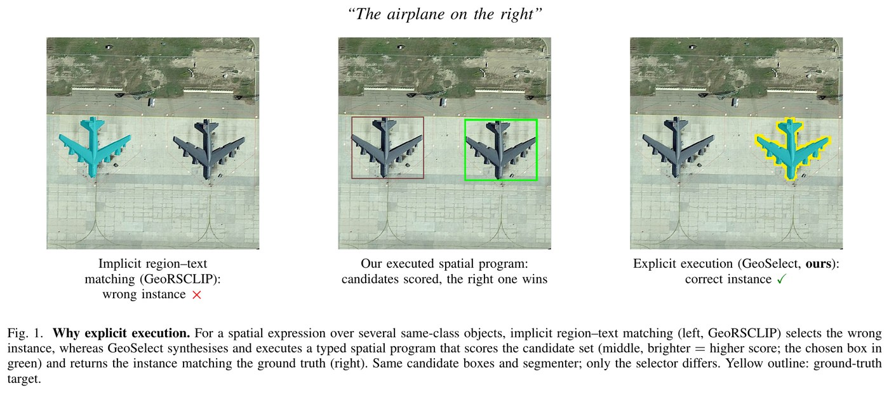
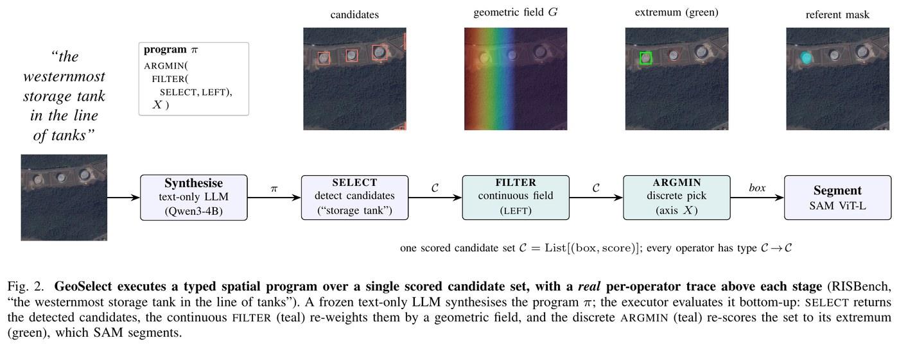

# GeoSelect：基于空间程序执行的免训练遥感指代图像分割

[](https://arxiv.org/abs/2607.03869)
[](https://avalon-s.github.io/GeoSelect/)
[](LICENSE)
[](#引用)

[English](README.md) · **简体中文**

GeoSelect 从航拍图像中分割出指代表达式所指的那一个目标，**全程不训练任何参数**。冻结的纯文本 LLM 把表达式
编译成小型空间 DSL 中的 typed program；well-formedness checker 验收该程序；确定性的 executor 在单一的
*scored candidate set* 上求值，这个类型把连续几何场与离散的集合、次序算子统一起来。reliability ladder 会把
任何失败的程序降级到 field-only special case，而不是放弃作答。



*隐式的 region–text 匹配选错了飞机，执行空间程序则选对了。候选框和 segmenter 相同，差别只在 selector。*

每个组件都是现成且冻结的：**零训练参数。**

| | RRSIS-D test | RISBench test |
|---|---|---|
| mIoU | **58.86** | **55.27** |
| oIoU | **59.48** | **55.88** |

两行结果出自同一套冻结配置，没有针对任一数据集重新调参。



*一个 scored candidate set 贯穿所有阶段：冻结的 LLM 合成程序，`Select` 检测，`Filter` 用连续几何场重新
加权，`Argmin` 沿某个轴取极值，SAM 把选中的框变成 mask。两张图均取自论文。*

---

## 目录

- [快速开始：无需 GPU 复现论文数字](#快速开始无需-gpu-复现论文数字)
  - [dump 里有什么](#dump-里有什么)
  - [图](#图)
- [安装](#安装)
  - [1. 主环境](#1-主环境)
  - [2. 隔离的检测环境](#2-隔离的检测环境)
  - [3. 模型权重](#3-模型权重)
  - [4. 数据集](#4-数据集)
  - [5. 长跑前先检查 detector bridge](#5-长跑前先检查-detector-bridge)
- [运行完整 pipeline](#运行完整-pipeline)
  - [每个 selector 是什么](#每个-selector-是什么)
- [仓库内容](#仓库内容)
  - [prompt](#prompt)
  - [论文引用的完整性检查](#论文引用的完整性检查)
  - [关于确定性](#关于确定性)
- [引用](#引用)
- [致谢](#致谢)
- [许可](#许可)

---

## 快速开始：无需 GPU 复现论文数字

逐样本 IoU dump 随仓库发布，因此 headline 数字、分层表格和 bootstrap 区间都能仅凭已发布数据重算——不需要
权重，不跑 detection，不跑 segmentation：

```bash
conda create -n geoselect python=3.10 -y
conda activate geoselect
pip install -r requirements.txt

python scripts/compute_ci.py          # headline mIoU + 95% CIs, per-stratum deltas

# the two reported runs -- these reproduce the headline table above
python scripts/make_tables.py experiments/runs/eval_rrsisd_test_oracle/summary.json \
                              experiments/eval_risbench_test/summary.json

# the second RRSIS-D run, which carries both selectors and so gives the V1-vs-V2 per-stratum delta
python scripts/make_tables.py experiments/eval_rrsisd_test/summary.json

python scripts/fig_failure_stats.py   # the one figure computed purely from the dumps
```

`compute_ci.py` 在输出区间前先用已发表数值校验自己的聚合结果（5,000 次重采样，seed 0），偏差会被报出而不是
被吸收。

**仓库里有两次 RRSIS-D test 运行。** 论文报告的 58.86 / 59.48 来自 `runs/eval_rrsisd_test_oracle/`，也是
`compute_ci.py` 断言的那一份。另一次 `eval_rrsisd_test/` 同时评估两个 selector，给出 58.77 / 59.60；因为
oracle 那次只对完整程序打分，它是唯一能重建 V1-vs-V2 分层对比的 dump。0.09 的差异是
[关于确定性](#关于确定性)中说明的 detector build 效应。RISBench 不受影响：两份 dump 都是 55.27 / 55.88。

### dump 里有什么

| 文件 | 行数 | 是什么 |
|---|---|---|
| `experiments/runs/eval_rrsisd_test_oracle/samples.jsonl` | 3,481 | **RRSIS-D test，论文报告的运行**（58.86 / 59.48），含 oracle selector 上界 |
| `experiments/eval_rrsisd_test/samples.jsonl` | 3,481 | 另一次 RRSIS-D test 运行，含两个 selector（58.77 / 59.60）——见上文 |
| `experiments/eval_risbench_test/samples.jsonl` | 16,159 | **RISBench test，论文报告的运行**（55.27 / 55.88），含两个 selector |
| `experiments/runs/eval_risbench_test_oracle/samples.jsonl` | 16,159 | RISBench 的 oracle 上界；完整程序的数值与上一行一致 |
| `experiments/runs/eval_rrsisd_val/samples.jsonl` | — | RRSIS-D val，全部 selector 消融 |

每行按表达式记录：合成出的 `program`、检出类别计数（`n_det`）、两个 selector 选中的框及其 IoU（`v1_*` =
仅连续场，`v2_*` = 完整程序 executor），以及 `v2_mode`——程序成功执行为 `v2`，被 reliability ladder 接住
为 `fallback`。

### 图

`fig_failure_stats.py` 以 oracle 上界为参照，把每次失败归因到第一个该负责的阶段——detection、selection
或 program path。

---

[↑ 目录](#目录)

## 安装

完整 pipeline 需要**两个 conda 环境**。主环境跑程序合成、执行与分割；隔离环境只跑 detector，通过子进程调用
而非 import。LAE-DINO 的 mmcv/mmdet 栈锁定 torch 1.10 / py3.8，而 parser 和 SAM 需要 torch 2.5 / py3.10；
独立进程还能在阶段之间释放 VRAM，使整条 pipeline 留在单张 24 GB 卡上。`detection.conda_env` 指定隔离环境。

下列版本即产出论文结果所用的版本。

### 1. 主环境

```bash
conda create -n geoselect python=3.10 -y
conda activate geoselect

pip install torch==2.5.1 torchvision==0.20.1 --index-url https://download.pytorch.org/whl/cu121
pip install -r requirements.txt
```

实测：Python 3.10.20、torch 2.5.1+cu121、torchvision 0.20.1+cu121、transformers 5.9.0、numpy 2.2.6、
pycocotools 2.0.11。

### 2. 隔离的检测环境

这个环境比较脆弱。`mmcv==2.2.0` 没有对应 torch 1.10 / cu113 的预编译 wheel，需从源码编译，要求 `nvcc`
可用。安装 LAE-DINO **自带的 mmdet fork**（`mmdetection_lae/`），不是 pip 的 `mmdet`。

```bash
conda create -n laedino python=3.8 -y
conda activate laedino

pip install torch==1.10.0+cu113 torchvision==0.11.1+cu113 torchaudio==0.10.0+cu113 \
  -f https://download.pytorch.org/whl/cu113/torch_stable.html

git clone https://github.com/jaychempan/LAE-DINO.git ~/LAE-DINO
cd ~/LAE-DINO && git checkout 44726020759dd5e72fd05d5e5c1059619ead2284

pip install -U openmim
mim install mmengine==0.10.4
mim install "mmcv==2.2.0"

cd ~/LAE-DINO/mmdetection_lae
pip install -v -e .
pip install -r requirements/multimodal.txt
pip install emoji ddd-dataset "git+https://github.com/lvis-dataset/lvis-api.git"
```

实测：Python 3.8.20、torch 1.10.0+cu113、mmcv 2.2.0、mmengine 0.10.4、transformers 4.46.3、numpy 1.24.4，
mmdet 以 editable 方式安装自 LAE-DINO commit `4472602`。

LAE-DINO 属 Grounding-DINO 系，需要 **BERT**，其配置以相对路径 `../weights/bert-base-uncased` 引用它（相对
`mmdetection_lae/` 解析）。下载到那里或建软链接：

```bash
mkdir -p ~/LAE-DINO/weights
ln -s "$GEOSELECT_WEIGHTS/bert-base-uncased" ~/LAE-DINO/weights/bert-base-uncased
```

### 3. 模型权重

把 `GEOSELECT_WEIGHTS` 指向存放下列权重的目录。本仓库不转发布任何权重，均来自各自出处。

| `$GEOSELECT_WEIGHTS` 下 | 作用 | 大小 | 许可 | 下载 |
|---|---|---|---|---|
| `Qwen3-4B/` | 程序合成，纯文本 | 7.6 GB | Apache-2.0 | [Qwen/Qwen3-4B](https://huggingface.co/Qwen/Qwen3-4B) |
| `LAE-DINO/checkpoints/lae_dino_swint_lae1m-28ca3a15.pth` | 开放词汇检测（SAHI 切图） | 691 MB | MIT | [jaychempan/LAE-DINO](https://huggingface.co/jaychempan/LAE-DINO) |
| `bert-base-uncased/` | LAE-DINO 的文本编码器 | 421 MB | Apache-2.0 | [google-bert/bert-base-uncased](https://huggingface.co/google-bert/bert-base-uncased) |
| `sam-vit-large/` | 分割，HF 格式 | 1.3 GB | Apache-2.0 | [facebook/sam-vit-large](https://huggingface.co/facebook/sam-vit-large) |

```bash
huggingface-cli download Qwen/Qwen3-4B            --local-dir "$GEOSELECT_WEIGHTS/Qwen3-4B"
huggingface-cli download facebook/sam-vit-large   --local-dir "$GEOSELECT_WEIGHTS/sam-vit-large"
huggingface-cli download jaychempan/LAE-DINO      --local-dir "$GEOSELECT_WEIGHTS/LAE-DINO"
huggingface-cli download google-bert/bert-base-uncased \
                                                  --local-dir "$GEOSELECT_WEIGHTS/bert-base-uncased"
```

parser 是**纯文本**的 Qwen3-4B：它从不接触图像，这也是单张 24 GB 卡够用的原因。传入 VL checkpoint 会在
加载时被拒绝。上述四个权重即复现论文配置所需的全部。

#### 可选：替换 decoder 或 selector

论文把冻结的 pipeline 与其他 mask decoder、以及一个隐式 region↔text selector 做了对比。两者都能在本仓库
运行，pipeline 其余部分不变；各需多下一个权重，论文报告的结果都不需要它们。

| 模型 | 出处 | 如何启用 |
|---|---|---|
| SAM 2.1 hiera-large (857 MB) | Ravi *et al.*, ICLR 2025 —— `.pt` 由 [facebookresearch/sam2](https://github.com/facebookresearch/sam2) 发布（`download_ckpts.sh`） | `--segmenter sam2.1`；`weights.sam2_ckpt` → `sam2/sam2.1_hiera_large.pt` |
| SAM 3 (3.3 GB) | [arXiv:2511.16719](https://arxiv.org/abs/2511.16719) —— [facebook/sam3](https://huggingface.co/facebook/sam3)；**gated**，须先接受 Meta 条款 | `--segmenter sam3`；`weights.sam3_path` → `sam3/` |
| GeoRSCLIP (RS5M ViT-H-14, 3.7 GB) | Zhang *et al.*, TGRS 2024 —— [Zilun/GeoRSCLIP](https://huggingface.co/Zilun/GeoRSCLIP) | `--selectors clip`；`weights.georsclip` → `georsclip/RS5M_ViT-H-14.pt` |

它们需要 `sam2` 和 `open_clip_torch`，已列在 `requirements.txt` 的可选区块。

### 4. 数据集

两个数据集都不在此转发布，请从提出它们的作者处获取。

| 数据集 | 出处 | 获取 |
|---|---|---|
| RRSIS-D | Liu *et al.*, *Rotated Multi-Scale Interaction Network for Referring Remote Sensing Image Segmentation*, CVPR 2024, [arXiv:2312.12470](https://arxiv.org/abs/2312.12470) | [Lsan2401/RMSIN](https://github.com/Lsan2401/RMSIN) |
| RISBench | Dong *et al.*, *Cross-Modal Bidirectional Interaction Model for Referring Remote Sensing Image Segmentation*, [arXiv:2410.08613](https://arxiv.org/abs/2410.08613) | [HIT-SIRS/CroBIM](https://github.com/HIT-SIRS/CroBIM) |

把 `GEOSELECT_DATA` 指向如下组织的目录：

```
RSSIS-D/
  rrsisd/{refs(unc).p, instances.json}            REFER layout
  images/rrsisd/
RISBench_orig/
  img_rgb/  mask/  output_phrase_<split>.txt      original CrOBIM layout
```

RISBench 按**原始 CrOBIM 布局**读取，而非 HuggingFace 的重打包版本，以保证对比同源。

### 5. 长跑前先检查 detector bridge

```bash
export GEOSELECT_DATA=/path/to/datasets
export GEOSELECT_WEIGHTS=/path/to/weights

conda run -n laedino python laedino_env/serve_detect.py --help
```

检测环境有问题时，`serve_detect.py` 按请求逐次报告失败而不让父进程崩溃，每个响应都带上 `error` 字段且不含
检测结果——因此静默的空结果集说明问题在 bridge，不在方法。

---

[↑ 目录](#目录)

## 运行完整 pipeline

```bash
conda activate geoselect

export GEOSELECT_DATA=/path/to/datasets
export GEOSELECT_WEIGHTS=/path/to/weights

python -m geoselect_v2.eval.run_eval --dataset rrsisd  --split test --selectors v1,v2
python -m geoselect_v2.eval.run_eval --dataset risbench --split test --selectors v1,v2
```

**跑完整 split 前先做冒烟测试。** 十余条表达式约一分钟就能走完每个阶段——合成、子进程 bridge、分割、打分：

```bash
python -m geoselect_v2.eval.run_eval --dataset rrsisd --split test --n 12 \
       --selectors v1,v2 --out-dir /tmp/smoke --cache-dir /tmp/smoke_cache
```

`--n` 确定性地取前 N 条表达式，写出的行与已发布的 `experiments/eval_rrsisd_test/samples.jsonl` 前 N 行
一一对应，可逐字段比对。逐样本 IoU 对得上，即说明整条链路接对了。

运行分阶段进行，三个模型不会同时占显存：加载 parser → 合成全部程序 → 卸载 → 检测（子进程，独立环境）→
加载 SAM → 出 mask。解析与检测结果缓存在 `experiments/cache/`，以实际输入为 key，改动 prompt 会自动让解析
缓存失效，崩溃后重跑会续上。检测阶段通常最耗时：它是唯一随图像数量而非表达式数量增长的阶段。

### 每个 selector 是什么

`--selectors` 在同一共享候选池上对多个 selector 打分，因此它们之间的差异只来自 selector 本身：

- `v2` —— 程序 executor（headline）
- `v1` —— 仅连续几何场，无离散算子
- `confidence` —— 取检测分最高者，不用几何
- `clip` —— GeoRSCLIP 的 region↔text 余弦相似度，不用几何
- `rule` —— 一条手写的图像框架启发式，无程序也无 LLM
- `llmrank` —— 由同一个 LLM 直接挑框，无程序
- `sizeop` / `compsize` / `sizeall` —— 尺寸算子消融，论文中作为负结果报告

---

[↑ 目录](#目录)

## 仓库内容

```
geoselect_v2/            the method
  parser/                typed DSL: grammar, type checker, LLM program synthesis
  executor/              recursive interpreter over the scored candidate set
  kernels/               banded (relative position) + extremal (superlative) kernels
  reliability.py         the fallback ladder
  configs/v2_frozen.yaml every threshold and kernel parameter used for the reported results
  prompts/               the few-shot prompt, verbatim, plus its ablation variants
geogrounder/             detection / segmentation / dataset readers, reused frozen
laedino_env/             the isolated detection side, run under its own interpreter
scripts/                 recompute the paper's numbers from the shipped dumps
experiments/             per-sample IoU dumps + run summaries for the reported runs
```

### prompt

`geoselect_v2/prompts/program_synthesis_fewshot.txt` 是产生全部报告数字的冻结 prompt。其余是论文讨论的
消融变体——`norules`（去掉规则）、`noexamples`（去掉示例）、`4shot`（十四条示例取四条），以及
`*.sizeops_dropped`（尺寸算子变体，作为负结果报告）。该 prompt 已在字符串层面验证与评测 split 不相交，
`scripts/check_fewshot_leakage.py` 可重跑这项检查。

### 论文引用的完整性检查

```bash
python scripts/check_fewshot_leakage.py   # prompt examples vs evaluation splits, exact match
python scripts/eval_program_legality.py   # program legality / fallback rate (needs the LLM)
```

### 关于确定性

合成采用贪心解码（`do_sample=False`），executor 是纯几何运算，SAM 以 `multimask_output=False` 运行，因此
相同输入重跑会得到相同的 mask。唯一可能移动数字的是不同的 detector build 或不同的 SAHI 切图，它们会改变
程序所执行于其上的候选集。

`compute_ci.py` 固定了自己的重采样 seed，每次运行打印相同区间。但 bootstrap 边界依赖该 seed：点估计精确，
而区间端点可能与论文中的值相差百分之几。所有报告的对比在这种波动下都不改变符号或显著性。

---

[↑ 目录](#目录)

## 引用

本文已被 IEEE Transactions on Geoscience and Remote Sensing 录用。卷期号确定前，请引用预印本：

```bibtex
@article{jiang2026geoselect,
  title   = {GeoSelect: Spatial-Program Execution for Training-Free Referring
             Remote Sensing Image Segmentation},
  author  = {Jiang, Yuhang and Deng, Guohui and Xu, Miaozhong and Ruan, Chao and
             Zhao, Jinling and Huang, Linsheng},
  journal = {arXiv preprint arXiv:2607.03869},
  year    = {2026}
}
```

待卷号与页码确定后，此条目将替换为期刊引用。

[↑ 目录](#目录)

## 致谢

GeoSelect 不训练任何东西，完全建立在他人公开的工作之上。感谢以下工作的作者：

- **LAE-DINO** —— 开放词汇 detector，冻结使用
  （[论文](https://arxiv.org/abs/2408.09110)，[代码](https://github.com/jaychempan/LAE-DINO)）。
- **Segment Anything** —— mask decoder，以 `multimask_output=False` 冻结使用。
- **Qwen3** —— 把表达式编译为程序的纯文本 LLM，冻结使用。
- **RRSIS-D** 与 **RISBench** —— 上文引用的两个 benchmark。

[↑ 目录](#目录)

## 许可

MIT，见 [LICENSE](LICENSE)。数据集与模型权重各自保留其原有许可。

[↑ 目录](#目录)
